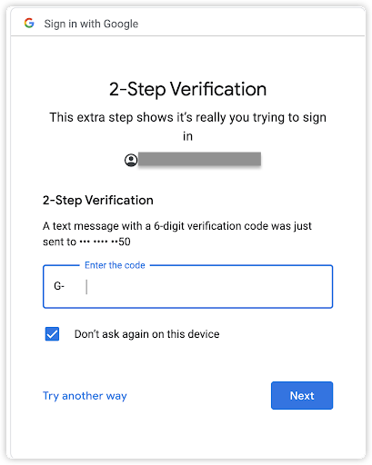

StreamNative 控制台是基于 Web 的 GUI 管理和监控工具，可帮助 Pulsar 用户管理租户、命名空间、主题、订阅等。

在[部署 StreamNative Platform](/operator-guides/deploy/sn-deploy.md) 和[部署 Pulsar 集群](/operator-guides/deploy/sn-deploy.md#部署-pulsar-集群)之后，可以登录 StreamNative 控制台来管理和监控 Pulsar 资源。

# 使用用户名和密码登录 StreamNative 控制台

按照如下步骤登陆 StreamNative 控制台：

1. 执行以下命令将 StreamNative 控制台服务暴露给 localhost 地址。

   ```
   kubectl port-forward RELEASE_NAME-pulsar-streamnative-console-0 9527:9527 -n KUBERNETES_NAMESPACE
   ```

2. 访问 StreamNative 控制台：http://localhost:9527。

3. 输入用户名和用户密码，然后点击 **登录** 以登录 StreamNative 控制台。

   默认情况下，StreamNative 控制台创建了一个 `admin` 用户。可以执行以下命令来获取密码。

   ```
   kubectl get secret RELEASE_NAME-sn-platform-vault-console-admin-passwd -o=jsonpath='{.data.password}' -n KUBERNETES_NAMESPACE | base64 --decode; echo
   ```

   

# 使用谷歌帐户登录 StreamNative 控制台

本节介绍如何使用谷歌帐户登录 StreamNative 控制台。

## 前提条件

使用谷歌帐户登录 StreamNative 控制台，需要开启谷歌 OAuth2 登录并配置相关参数。具体参见[配置 StreamNative 控制台](/operator-guides/configure/streamnative-console.md)。

要使用谷歌帐户登录 StreamNative 控制台，请按照以下步骤操作：

1. 执行以下命令将 StreamNative 控制台服务暴露给 localhost 地址。

   ```
   kubectl port-forward RELEASE_NAME-pulsar-streamnative-console-0 9527:9527 -n KUBERNETES_NAMESPACE
   ```

2. 访问 StreamNative 控制台：http://localhost:9527。

3. 点击**用谷歌登录**。

   

4. 输入你的邮箱，然后点击**下一步**。

5. 输入你的密码，然后点击**下一步**。

6. （可选）如果启用了双因素身份验证（2FA），则要输入验证码，然后单击**下一步**。

   

然后，你将看到 StreamNative 控制台 GUI，并且可以管理以下资源：

- [服务帐号](/user-guides/admin/work-with-service-accounts.md)
- [用户](/user-guides/admin/work-with-users.md)
- [租户](/user-guides/admin/work-with-tenants.md)
- [命名空间](/user-guides/admin/work-with-namespaces.md)
- [主题](/user-guides/admin/work-with-topics.md)
