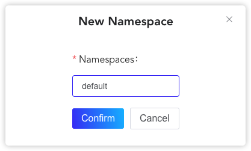
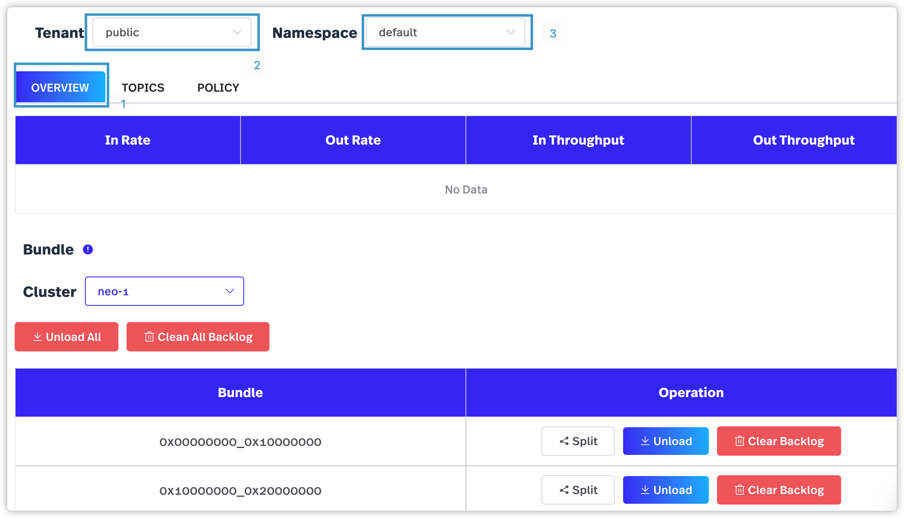

在 Pulsar 中，租户内的管理单元称为命名空间。本文介绍了如何使用 pulsarctl CLI（命令行工具）或 StreamNative 控制台为集群创建和管理命名空间。

# 使用 pulsarctl CLI 操作命名空间

可以使用 pulsarctl CLI（命令行工具）创建和管理命名空间。有关命名空间支持操作的完整列表，参见 [pulsarctl 命令参考](https://docs.streamnative.io/pulsarctl/v2.7.0.7/#-em-update-em--32)。

> **注意**
> 
> 本节使用名为 `example-tenant` 的租户作为示例。关于如何创建租户的详细内容，参见[关于租户的操作](/user-guides/admin/work-with-tenants.md)。

## 创建命名空间

在创建和授权租户后，就可以创建和管理命名空间和主题。

如下示例显示了如何为 `example-tenant` 创建一个名为 `example-ns` 的命名空间。

**输入**

```
pulsarctl namespaces create example-tenant/example-ns
```

**输出**

```
Created example-tenant/example-ns successfully
```

## 清空命名空间 backlog

Pulsar 将所有未确认的消息存储在 backlog 中，直到它们被处理和确认。可以清除特定命名空间的 backlog，以释放更多命名空间的 backlog quota。

如下示例显示了如何清除 `example-tenant/example-ns` 的所有主题的 backlog。

**输入**

```
pulsarctl namespaces clear-backlog example-tenant/example-ns
```

**输出**

```
Are you sure you want to clear the backlog? (Y or N)

y

Successfully clear backlog for all topics of the example-tenant/example-ns
```

## 卸载命名空间

如下示例显示了如何从当前的服务中的 broker 卸载 `example-tenant/example-ns`。

**输入**

```
pulsarctl namespaces unload example-tenant/example-ns
```

**输出**

```
Unload namespace example-tenant/example-ns successfully
```

## 删除命名空间

> **注意**
> 
> 只有在没有资源和命名空间关联时，才能将命名空间删除。

如下示例显示了如何删除 `example-tenant/example-ns`。

**输入**

```
pulsarctl namespaces delete example-tenant/example-ns
```

**输出**

```
Deleted example-tenant/example-ns successfully
```

# 使用 StreamNative 控制台操作命名空间

本节介绍了如何使用 StreamNative 控制台来创建和管理命名空间。在使用 StreamNative 控制台创建和管理命名空间之前，需要先创建一个租户。详细信息参见[关于租户的操作](/user-guides/admin/work-with-tenants.md)。

## 创建命名空间

按照如下步骤创建命名空间：

1. 从左侧导航窗格中，点击**命名空间**。

2. 点击**创建命名空间**。出现一个对话框。

   

3. 输入命名空间的名称，然后点击**确定**。命名空间名称为最多 40 个字符的字符串，支持小写字母（a-z）、数字字符（0-9）和特殊字符连字符（-）。

## 查看命名空间统计信息

按照如下步骤操作，查看命名空间的统计信息：

1. 从左侧导航窗格中，单击**命名空间**。

2. 选择**概况**选项卡。

3. 分别从下拉列表中选择目标租户和命名空间。下表列出了有关命名空间的统计信息。

   

    <table>
    <tr>
    <td>
    项目
    </td>
    <td>描述
    </td>
    </tr>
    <tr>
    <td>输入速率
    </td>
    <td>命名空间的入口速率。 
    </td>
    </tr>
    <tr>
    <td>输出速率
    </td>
    <td>命名空间的出口速率。
    </td>
    </tr>
    <tr>
    <td>输入吞吐量
    </td>
    <td>命名空间的入口吞吐量。
    </td>
    </tr>
    <tr>
    <td>输出吞吐量
    </td>
    <td>命名空间的出口吞吐量。
    </td>
    </tr>
    </table>

4. 选择**主题**选项卡，查看该命名空间可用主题的数量和有关主题的统计信息。此外，还可以创建新主题并更新特定主题。

## 卸载命名空间的 bundle

为了进行分配，命名空间被分成多个 bundle，每个 bundle 包括命名空间整体哈希范围的一部分。默认情况下，每个命名空间支持 4 个 bundle。

按照以下步骤，卸载命名空间的 bundle：

1. 在左侧导航窗格中，点击**命名空间**。

2. 选择**概况**选项卡。

3. 分别从下拉列表中选择目标租户和命名空间。

4. 在 **Bundle** 部分，从**集群**下拉列表中选择目标集群，然后点击**全部卸载**，即可从集群中卸载命名空间的所有 bundle。

5. 在 **Bundle** 部分，点击特定 bundle 旁边的**卸载**，即可卸载该 bundle。

## 拆分命名空间的 bundle

由于 bundle 中主题的负载可能会随时间变化，因此 broker 可以将一个 bundle 拆分成两个 bundle。然后，新的较小的 bundle 会被重新分配给不同的 broker。默认情况下，新拆分的 bundle 会立即卸载给其他的 broker 以促进流量分配。

按照如下步骤，拆分命名空间的 bundle：

1. 在左侧导航窗格中，点击**命名空间**。

2. 选择**概况**选项卡。

3. 分别从下拉列表中选择目标租户和命名空间。

4. 在 **Bundle** 部分，点击特定 bundle 旁边的**拆分**，即可拆分命名空间的 bundle。

## 清除命名空间 backlog

按照如下步骤，可以清除命名空间 bundle 的 backlog：

1. 在左侧导航窗格中，点击**命名空间**。

2. 选择**概况**选项卡。

3. 分别从下拉列表中选择目标租户和命名空间。

4. 在 **Bundle** 部分，从**集群**下拉列表中选择目标集群，点击**清除全部 Backlog** ，即可清除命名空间中所有主题的 backlog。

5. 在 **Bundle** 部分，点击特定 bundle 旁边的**清除 Backlog**，即可清除命名空间中该 bundle 所有主题的 backlog。

## 配置命名空间策略

在命名空间上设置的策略，适用于在该命名空间中创建的所有主题。

按照如下步骤，配置命名空间的策略：

1. 在左侧导航窗格中，点击**命名空间**。

2. 选择**策略**选项卡。

3. 分别从下拉列表中选择目标租户和命名空间。

4. 按照如下表格，为命名空间配置策略。

   

    <table>
    <tr>
    <td>
    字段
    </td>
    <td>描述
    </td>
    </tr>
    <tr>
    <td>集群
    </td>
    <td>选择集群副本。在该命名空间，主题中的消息将被异步复制到配置的集群副本中。此版本中，集群副本与你创建的集群相同，因为一个实例只有一个集群可用。
    </td>
    </tr>
    <tr>
    <td>授权
    </td>
    <td>授予/撤消其他客户端角色在此命名空间中的权限。
    <ul>

    <li>consume：授予/撤销消费操作。
   
    <li>produce：授予/撤销生产操作。
   
    <li>functions：授予/撤销 Pulsar Functions 操作。
   
    <p>
    点击<strong>添加角色</strong>将一个或多个服务账号添加为命名空间的管理员。
    <p>
    点击<strong>删除角色</strong>将某个特定的服务账号从命名空间的管理员列表中删除。
    </li>
    </ul>
    </td>
    </tr>
    <tr>
    <td>订阅认证
    </td>
    <td>配置订阅认证模式，以在认证启用时限制订阅的命名规则。
    <ul>

    <li>None：Pulsar 客户端可以使用任何允许的订阅名称连接到集群。
   
    <li>Prefix：Pulsar 客户端只能使用以角色名称为前缀的订阅名称来订阅消息。
   
    <p>
    默认设置为 <em>None</em>。
    </li>
    </ul>
    </td>
    </tr>
    <tr>
    <td>储存
    </td>
    <td>配置命名空间的储存策略。 
   
    **副本因子**：配置存储副本的设置。<ul><li> Ensemble size：创建 ledger 时要使用的 bookie 的数量。<li> Write Quorum Size：每条消息存储的副本数。<li> Ack Quorum Size：确认消息保证被存储前需等待的响应次数。</ul>
   **Mark-Delete Rate**：每秒允许的 mark-deletion 的调用次数。当该值设置为 0 时，则禁用速率限制器。默认值为 0。</p>
   **需要加密**：为命名空间启用/禁用消息加密。<ul><li> 使能：为命名空间启用消息加密。<li> 禁用：为命名空间禁用消息加密。</ul>
   **消息去重**：为命名空间启用/禁用消息去重。<ul><li> 使能：为命名空间启用消息去重。<li>  禁用：为命名空间禁用消息去重。</ul>
    </td>
    </tr>
    <tr>
    <td>Backlog
    </td>
    <td>为命名空间配置 backlog 策略。

    **堆积量**：命名空间允许的最大堆积量（以字节为单位）。堆积量必须小于 1000000000 字节。默认设置为 -1073741824 字节。</p> **Backlog 保留策略**：backlog 的保留策略。<ul><li> consumer_backlog_eviction：broker 开始移除 backlog 消息。<li>producer_exception：broker 抛出异常，与客户端断开连接。<li>producer_request_hold：broker 保持但不保留生产者请求的有效载荷。</ul>
    </td>
    </tr>
    <tr>
    <td>Schema
    </td>
    <td>为命名空间配置 schema 策略。
    <ul>
   
    <li>AutoUpdate 策略：为命名空间配置 schema 的自动更新策略。
   
    <li>Schema 有效性：为没有 schema 的生产者启用/禁用验证。如果禁用，则不允许没有 schema 的生产者向具有 schema 的主题生产消息。
    </li>
    </ul>
    </td>
    </tr>
    <tr>
    <td>Cleanup 策略
    </td>
    <td>为命名空间配置 cleanup 策略。
   
    <ul>
   
    <li>消息 TTL（秒）：配置消息 TTL（秒）。在 TTL 周期内，如果没有任何消费者消费该消息，当 TTL 周期结束后，该消息被标记为“已消费”。
   
    <li>保留大小（字节）：配置保留大小。该字段仅适用于被所有订阅确认的消息。保留大小必须小于 1000 MB。 默认值为 0。
   
    <li>保留周期（分钟）：配置保留周期。该字段仅适用于被所有订阅确认的消息。默认值为 0。
   
    <li>压缩阈值（字节）：配置压缩主题的阈值。当达到阈值时自动触发压缩。默认值为 0。
   
    <li>卸载阈值（字节）：配置阈值以卸载消息。当达到阈值时，消息会自动卸载到层级存储。默认值为 -1。
   
    <p>
    卸载删除延迟（毫秒）：从 BookKeeper 卸载的 ledger 被删除前的等待时间（以毫秒为单位）。当该值设置为负值时，禁用卸载删除。
    </li>
    </ul>
    </td>
    </tr>
    <tr>
    <td>限流
    </td>
    <td>配置命名空间的限流策略。
    <ul>
   
    <li>最大生产者数量（基于主题）：配置每个主题支持的最大生产者的数量。
   
    <li>最大消费者数量（基于主题）：配置每个主题支持的最大消费者的数量。 
   
    <li>最大消费者数量（基于订阅）：配置每个订阅支持的最大消费者的数量。
    </li>
    </ul>
    </td>
    </tr>
    <tr>
    <td rowspan="3" >调度速率
    </td>
    <td>调度速率（基于主题）：配置基于主题的调度速率。  
   
    <ul>
   
    <li>吞吐量（字节/秒）：配置主题中字节的调度速率。
   
    <li>速率（消息/秒）：配置主题中消息的调度速率。时间周期（秒）：调度速率的周期。
    </li>
    </ul>
    </td>
    </tr>
    <tr>
    <td>调度速率（基于订阅）：配置基于订阅模式的调度速率。 
   
    <ul>
   
    <li>吞吐量（字节/秒）：配置订阅中字节的的调度速率。
   
    <li>速率（消息/秒）：配置订阅消息的调度速率。 
   
    <li>时间周期（秒）：配置调度速率的周期。 
    </li>
    </ul>
    </td>
    </tr>
    <tr>
    <td>调度速率（基于消费者）：配置消费者订阅主题的速率。 
   
    <ul>
   
    <li>吞吐量（字节/秒）：配置消费者订阅的主题的吞吐量。
   
    <li>速率（消息/秒）：配置消费者订阅的主题的速率。
    </li>
    </ul>
    </td>
    </tr>
    </table>

## 删除命名空间

按照如下步骤删除命名空间：

1. 在左侧导航窗格中，点击**命名空间**。

2. 选择**策略**选项卡。

3. 分别从下拉列表中选择目标租户和命名空间。

4. 向下滚动页面，然后点击**删除命名空间**。出现对话框显示：*“删除命名空间”*

   

5. 输入命名空间的名称，然后点击**确定**。