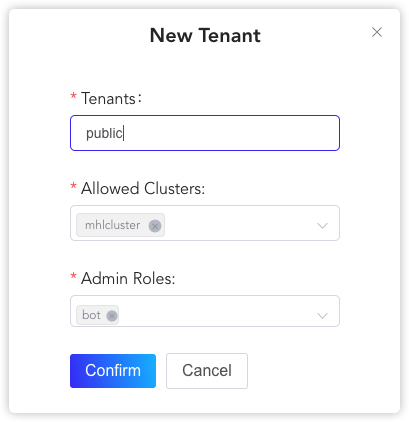

Pulsar 从诞生开始就是按照多租户系统设计的。为了支持多租户，Pulsar 引入了租户概念。租户可以分布在多个集群中，并且每个租户都具有自己的身份验证和授权方案。

本文介绍了如何使用 pulsarctl CLI（命令行工具）或 StreamNative 控制台为集群创建和管理租户。

# 使用 pulsarctl CLI 操作租户

使用 pulsarctl CLI （命令行工具）可以创建、更新和删除租户。有关租户操作的完整列表请参见 [pulsarctl 命令参考](https://docs.streamnative.io/pulsarctl/v2.7.0.7/#-em-update-em--32)。

在使用 pulsarctl CLI（命令行工具）前，需要先连接到 Pulsar 集群。详细信息请参见[此处](/user-guides/connect/connect-pulsar-cluster/cli-tools/connect-pulsarctl.md)。

## 创建租户

创建 Pulsar 集群后，可以为 Pulsar 集群创建租户。在创建租户时，需要使用 `-cluster` 或 `-c` 选项为租户指定目标集群。

如下示例介绍了如何在 `example-cluster` 集群创建名为 `example-tenant` 的租户，并配置管理员角色。如果在创建租户时未配置管理员角色，则无法对目标租户进行后续操作，如更新或删除租户。

**输入**

```bash
pulsarctl tenants create example-tenant -r bot@matrix.auth.streamnative -c example-cluster
```

**输出**

```shell
Create tenant example-tenant successfully
```

## 更新租户

当需要为租户添加更多管理员角色时，可以使用 `pulsarctl tenants update` 命令来更新目标租户。

如下示例显示了如何更新 `example-tenant` 的管理员角色。

**输入**

```bash
pulsarctl tenants update --admin-roles (bot) --admin-roles (bot1) example-tenant -c example-cluster
```

**输出**

```bash
Update tenant example-tenant successfully
```

## 删除租户

当需要从 Pulsar 集群中移除租户时，可以将其删除。但如果租户与任何资源存在关联，则无法删除该租户。在这种情况下，必须要先删除与其关联的资源。

如下示例显示了如何删除 `example-tenant`。

**输入**

```
pulsarctl tenants delete example-tenant
```

**输出**

```
Delete tenant example-tenant successfully
```

# 使用 StreamNative 控制台操作租户

可以使用 StreamNative 控制台创建、更新和删除租户。

## 创建租户

按照如下步骤使用 StreamNative 控制台创建租户：

1. 从左侧导航窗格中，点击**租户**。

2. 点击**创建租户**，出现一个对话框。

    

3. 按下表配置租户。

    <table>
    <tr>
    <td>
    字段
    </td>
    <td>描述
    </td>
    </tr>
    <tr>
    <td>租户
    </td>
    <td>
    输入租户的名称。租户名称为字符串，支持小写字母 (a-z)、数字字符 (0-9) 和特殊字符连字符 (_)。
    </td>
    </tr>
    <tr>
    <td>所属集群
    </td>
    <td>
    从列表中选择租户所属的集群。
    </td>
    </tr>
    <tr>
    <td>Admin 角色
    </td>
    <td>
    选择一个或多个用户或服务帐户作为租户的管理员。
    </td>
    </tr>
    </table>

4.点击**确定**。

## 更新租户

如果要为租户创建命名空间，或为租户添加或删除管理员角色，可以更新租户。按照如下操作，使用 StreamNative 控制台更新租户：

1. 从左侧导航窗格中，点击**租户**。

2. 执行以下操作之一，进入租户编辑页面：

   - 点击**操作**列中的**编辑**图标。
   - 点击租户名称的链接。

   

3. 选择**命名空间**选项卡，然后点击**创建命名空间**，为租户添加更多的命名空间。关于如何创建命名空间的详细操作，参见[创建命名空间](/user-guides/admin/work-with-namespaces.md#创建命名空间)。

4. 选择**配置**选项卡，更新租户的配置。

   * 要删除管理员，请点击现有管理员的**删除**图标。
   * 要添加管理员，请单击**添加角色**，然后从下拉列表中选择一个或多个用户或服务帐户。

## 删除租户

按照如下步骤操作，使用 StreamNative 控制台删除租户：

1. 从左侧导航窗格中，点击**租户**。

2. 点击**操作**列中的**编辑**图标，或点击租户名称的链接，然后出现一个页面。

3. 点击**删除租户**，出现对话框显示*"删除租户"*。

   

4. 输入租户名称，点击**确定**。